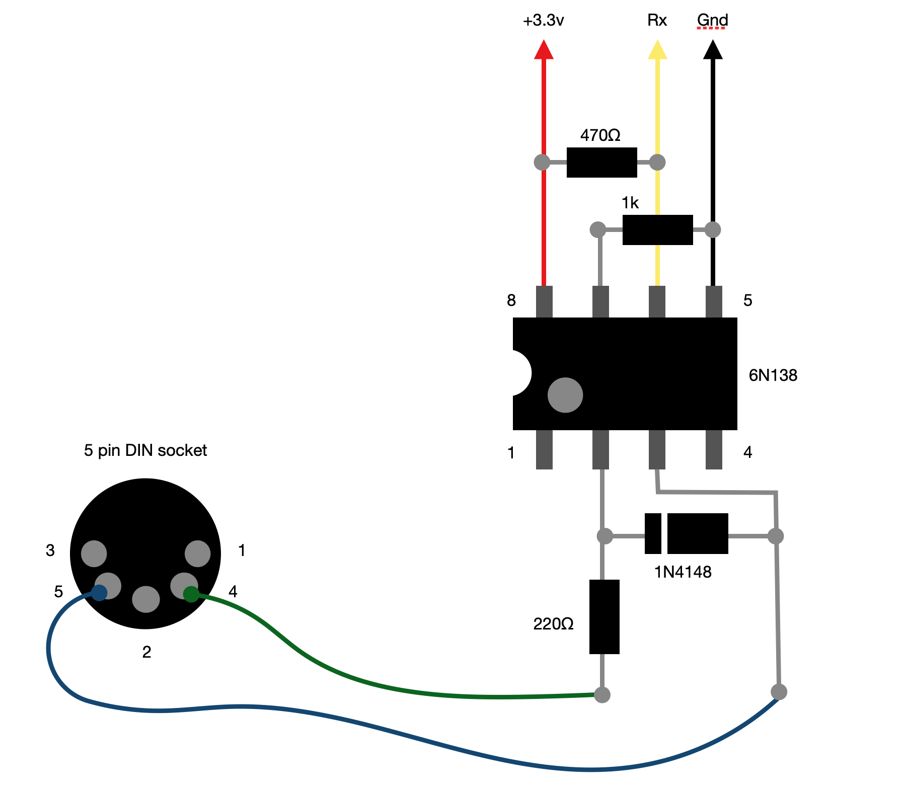

### Midi to Serial UART

This project provides a simple cicuit diagram for converting standard midi output signals into serial UART signals, capable of being received by our AgonLight2 (or other micro controllers).

Assembly code is included as well as a binary to monitor serial signals being received by AgonLight.

