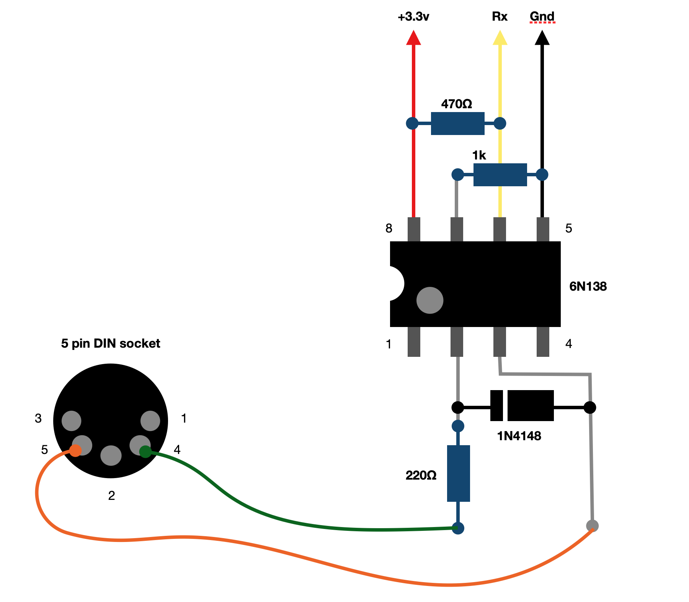

### Midi to Serial UART

This project provides a simple cicuit diagram for converting standard midi output signals into serial UART signals, capable of being received by our AgonLight2 (or other micro controllers).

Assembly code is included as well as a binary to monitor serial signals being received by AgonLight.

Parts required:

D1 		    1N4148 switching signal diode 		

DIN1 		  DIN-5 jack (MIDI), or wire direct to a 5 PIN plug 	

IC1 		  6N138 Optoisolator

R1 		    220 ohm Resistor 		

R2 		    470 ohm Resistor 		

R3 		    10k ohm Resistor 	

